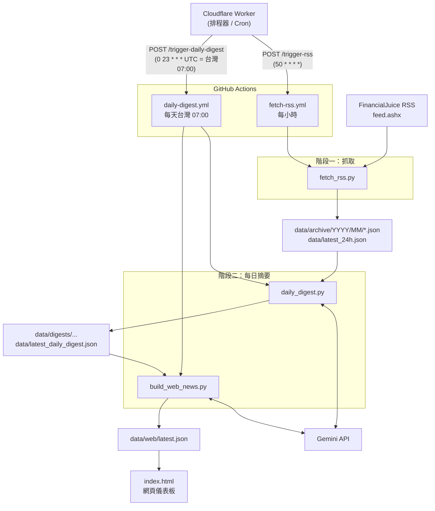

# mh-archive-pipeline 流程說明文件

本專案是一條 **全球金融市場新聞（FinancialJuice）自動歸檔 + Gemini 每日摘要** 的資料管線。
從抓取英文快訊、依台灣時間歸檔、用 Gemini 分類去重評分，到最後產出網頁儀表板資料，全程自動化。

---

## 一、整體架構總覽



**一句話總結：**
Cloudflare 只負責「定時按下按鈕」，真正做事的是 GitHub Actions 裡的 Python 程式，資料則全部以 JSON 檔存在 repo 內（把 git repo 當資料庫用）。

---

## 二、觸發機制（Cloudflare Worker）

Cloudflare Worker（`market-headline-trigger`）本身**不做任何資料處理**，唯一職責是依排程呼叫 GitHub Actions 的 `workflow_dispatch` API。

| 排程 (Cron, UTC) | 實際時間 | 觸發的 Workflow | 用途 |
|---|---|---|---|
| `50 * * * *` | 每小時第 50 分 | `fetch-rss.yml` | 抓 RSS |
| `0 23 * * *` | 台灣時間隔天 **07:00**（UTC 23:00 + 8h） | `daily-digest.yml` | 產生每日摘要 |

- Worker 也提供手動端點：`POST /trigger-rss`、`POST /trigger-daily-digest`。
- 需要 Cloudflare Secret：`GITHUB_TOKEN`（具 workflow dispatch 權限）。
- **重點：** Cloudflare Cron 一律以 **UTC** 計算，這也是為什麼「台灣早上 7 點」要設成 `0 23`。

> 注意：GitHub 的 dispatch 成功回應可能是 HTTP `200` 或 `204`，Worker 端判斷成功需用 `response.ok`（涵蓋 2xx），只認 `204` 會把成功誤判為失敗。

---

## 三、階段一：抓取與歸檔（`fetch_rss.py`）

由 `fetch-rss.yml` 每小時觸發，流程如下：

1. **下載** FinancialJuice RSS（`https://www.financialjuice.com/feed.ashx?xy=rss`）。
2. **解析與清理**每一則快訊：
   - 去除 HTML 實體、多餘空白。
   - 移除標題前綴 `FinancialJuice:`。
   - 解析發布時間，**統一轉成台灣時間 GMT+8** 儲存。
   - 用 GUID / 連結 / 標題+時間 產生 SHA-256 唯一 `id`（用於去重）。
3. **依台灣日期歸檔**到 `data/archive/YYYY/MM/YYYY-MM-DD.json`，與既有資料**依 id 合併去重**（只新增、不覆蓋）。
4. **產生最近 24 小時清單** `data/latest_24h.json`（比較時換算成 UTC，確保 24h 區間正確；會跨讀今天與昨天兩個檔案）。
5. **寫入狀態** `data/fetch_status.json`（成功/失敗、筆數、變更檔案）。
6. Workflow 最後 `git commit` + `push`，把新資料存回 repo（作者為 `github-actions[bot]`）。

**寫檔採「先寫 .tmp 再 replace」**，避免中途失敗造成 JSON 損毀。

### 產出檔案
- `data/archive/YYYY/MM/*.json` — 永久歷史檔（每日一檔）
- `data/latest_24h.json` — 最近 24 小時（供階段二使用）
- `data/fetch_status.json` — 抓取狀態

---

## 四、階段二：每日 Gemini 摘要（`daily_digest.py`）

由 `daily-digest.yml` 每天台灣 07:00 觸發。**輸入是 `data/latest_24h.json`。**

1. **本地預處理**：清理欄位、依 id 去重，再依「正規化後標題」去除完全重複，只保留最早一則。
2. **打包**成精簡輸入（只送 `id / time / headline` 三個欄位給 Gemini，控制在 50 萬字元內）。
3. **呼叫 Gemini**（模型由 workflow 的 `GEMINI_MODEL` 指定，目前 `gemini-3.5-flash`），要求它：
   - 只分成六類：**債市、股市、央行、財政政策、經濟、戰爭**。
   - 依 System Prompt 內的規則**刪除無市場意義的快訊**（純報價、小國數據、中國官方非政策發言等，見程式內 1–12 條規則）。
   - 對留下的新聞評 **1–5 分重要性**（`importance_score`）。
   - 對同一事件建立**事件軌跡 `trajectory`**（後續發展/修正/否認/確認）。
   - 翻成繁體中文，並輸出嚴格 JSON。
   - **防幻覺**：只能用輸入提供的 `id`，不可虛構事實；`temperature=0.1`。
4. **正規化輸出**：只保留 `source_id` 對得上原始資料的項目，依重要性與時間排序。
5. **失敗重試**：對 429/500/502/503/504 做指數退避重試（最多 3 次）。

### 產出檔案
- `data/digests/YYYY/MM/YYYY-MM-DD.json` — 當日完整摘要（永久）
- `data/latest_daily_digest.json` — 最新摘要
- `data/debug/...` + `data/latest_digest_debug.json` — Gemini「刪掉/留下」的 headline 清單（除錯用）
- `data/digest_status.json` — 摘要狀態

---

## 五、階段三：網頁資料（`build_web_news.py`）

在同一個 `daily-digest.yml` 內，緊接著 digest 之後執行，把 digest 轉成前端要用的格式。

1. **決定顯示區間 `calculate_display_window`**：
   - 週二～週五：顯示「昨天 17:00 ～ 現在」。
   - 週六/日/一：往回抓到「上週五 17:00 ～ 現在」（涵蓋週末）。
   - 區間結束時間以 **RSS 最後成功抓取時間** 為準（只重跑摘要不會讓時間跳動）。
2. **讀取區間內的 digest 檔**，篩出落在區間內的事件（事件本身或其 trajectory 有任一時間落在區間即算）。
3. **再呼叫一次 Gemini**：從所有事件中挑出 **5–10 點最重要摘要**（放網頁最上方），優先 5 分、4 分事件。
4. **依六大分類分組**（每組內依時間由早到晚排列），標記 `highlight = importance >= 4`。

### 產出檔案
- `data/web/latest.json` — 前端唯一資料來源（含 summary_points + 分類 blocks）
- `data/web/status.json` — 網頁資料狀態

---

## 六、前端（`index.html`）

- 純靜態頁面，載入時 `fetch('./data/web/latest.json')`（帶時間戳避免快取）。
- 依 `summary_points`（頂部重點）與六大分類 `blocks` 動態渲染成儀表板。

---

## 七、資料檔案地圖

```
data/
├── archive/YYYY/MM/YYYY-MM-DD.json   # 階段一：每日永久歷史
├── latest_24h.json                   # 階段一→階段二 的橋樑
├── fetch_status.json                 # 階段一狀態
├── digests/YYYY/MM/YYYY-MM-DD.json   # 階段二：每日摘要（永久）
├── latest_daily_digest.json          # 階段二：最新摘要
├── debug/…  + latest_digest_debug.json  # 階段二：Gemini 取捨除錯
├── digest_status.json                # 階段二狀態
└── web/
    ├── latest.json                   # 階段三：前端資料來源
    └── status.json                   # 階段三狀態
```

---

## 八、排程時間總表

| 時間（台灣 GMT+8） | 動作 |
|---|---|
| 每小時 :50 | 抓 RSS → 歸檔 → 更新 `latest_24h.json` |
| 每天 07:00 | 產生 Gemini 每日摘要 → 產生網頁資料 |

---

## 九、需要的密鑰（Secrets）

| 位置 | 名稱 | 用途 |
|---|---|---|
| Cloudflare Worker Secret | `GITHUB_TOKEN` | 讓 Worker 觸發 GitHub Actions |
| GitHub Repo Secret | `GEMINI_API_KEY` | 呼叫 Gemini API |

（`daily-digest.yml` 內另以 `GEMINI_MODEL`、`TZ=Asia/Taipei` 設定模型與時區。）

---

## 十、手動觸發方式

```powershell
# 手動抓一次 RSS
Invoke-RestMethod -Method Post -Uri "https://market-headline-trigger.bruce851117.workers.dev/trigger-rss"

# 手動產生一次每日摘要
Invoke-RestMethod -Method Post -Uri "https://market-headline-trigger.bruce851117.workers.dev/trigger-daily-digest"
```

也可直接在 GitHub 的 Actions 分頁對 `fetch-rss.yml` / `daily-digest.yml` 按 **Run workflow**（兩個 workflow 都設定為 `workflow_dispatch`）。

---

## 十一、設計重點回顧

- **Git repo 當資料庫**：所有資料以 JSON 存在 repo，方便版本追蹤與零成本託管。
- **時間一律台灣時間 GMT+8**：內部計算用 UTC，寫檔統一 GMT+8，避免跨日錯亂。
- **兩層 Gemini**：第一層（digest）做分類/去重/評分；第二層（web）做頂部重點摘要。
- **強防幻覺**：只准使用輸入的 id、禁止虛構、低 temperature。
- **原子寫檔 + 去重合併**：先寫 `.tmp` 再 replace；歷史檔只增不覆蓋。
